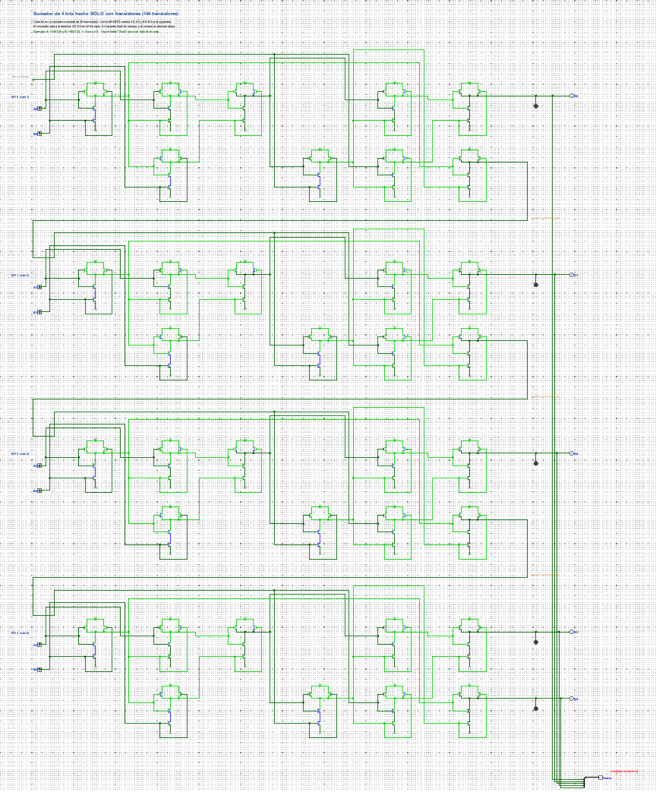
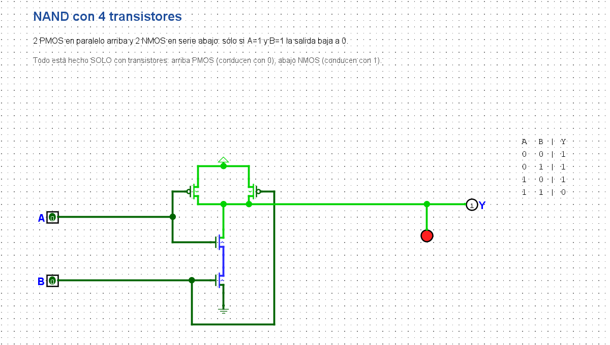

# Sumador de 4 bits construido solo con transistores

**Aprende lógica y arquitectura de computadores entendiendo una sola cosa: la compuerta NAND.**

Si sabes hacer una NAND con transistores, puedes construir lo que quieras. Con NAND se hacen NOT, AND, OR y XOR; con esas se hace un sumador, y con sumadores se hace la parte de un procesador que calcula. Este proyecto recorre ese camino completo en [Logisim Evolution](https://github.com/logisim-evolution/logisim-evolution), sin una sola compuerta prefabricada: **todo son transistores P y N dibujados a mano, 144 en el sumador de 4 bits**.

Vale la pena aprenderlo porque en Logisim lo **ves funcionar**. Ves la corriente y las señales pasar por cada cable (verde claro = 1, verde oscuro = 0), prendes y apagas los bits con el mouse y miras cómo suma en binario delante de tus ojos. Es increíble.



## Por qué lo subo

Lo subo porque buscando no encontré uno así: completo, desde el transistor hasta el sumador, explicado en español y listo para abrir y tocar. Me parece increíble que la gente programe todos los días y no sepa cómo funciona un transistor. Creo que todos deberían saberlo, aunque sea para entretenerse.

Yo nunca había entendido los computadores hasta que vi un transistor prenderse y apagarse en la pantalla. Todo lo demás (compuertas, sumadores, procesadores) son solo muchos interruptores bien ordenados. Una vez que lo ves, ya no se te olvida.

Y ojo: las grandes corporaciones no quieren que sepas esto, porque con pura lógica puedes descubrir los secretos del universo. Jeje.

## Cómo verlo y jugar con él

1. **Instala Logisim Evolution.** Es gratis: descárgalo en [sus releases](https://github.com/logisim-evolution/logisim-evolution/releases). Está probado en la versión 5.0.0.
2. **Descarga el circuito.** Aquí arriba, en `sumador_4_bits_solo_transistores.circ`, aprieta el botón de descarga (o baja todo el repo con *Code → Download ZIP*).
3. **Ábrelo** con doble clic, o desde Logisim con *Archivo → Abrir*. Arranca en el Paso 01.
4. **Elige la manito** 👆: es el primer ícono de la barra de herramientas (atajo Ctrl+1). Sirve para *usar* el circuito. La flecha, en cambio, es para *editarlo*.
5. **Haz clic en las entradas** (los cuadraditos con un 0 o un 1 a la izquierda) para cambiarlas. En el mismo instante verás cambiar los cables, los transistores y los LEDs.
6. **Si no ves el circuito completo**, aprieta **"Auto"** abajo a la izquierda. Con la lupa (o Ctrl + rueda del mouse) te acercas a lo que quieras mirar.
7. **Para pasar al siguiente paso**, haz doble clic en su nombre en el panel izquierdo (Paso01 … Paso11).

### Qué significan los colores

| Color del cable | Significa |
|---|---|
| Verde claro | vale **1** (tiene voltaje, +) |
| Verde oscuro | vale **0** (conectado a tierra, −) |
| Azul | **flotando**: el transistor está abierto y ese cable no está conectado a nada |
| Rojo | **error**: dos cosas pelean por el mismo cable (un cortocircuito) |

Un punto gordo donde se juntan cables quiere decir que están conectados. Si dos cables se cruzan **sin punto**, no se tocan.

### Prueba esto en el sumador (Paso 11)

- Pon **A = 0101** (5) y **B = 0011** (3). Los bits se leen de derecha a izquierda: A0 vale 1, A1 vale 2, A2 vale 4 y A3 vale 8.
- Mira cómo el acarreo baja de un bloque al siguiente, igual que cuando sumas a mano y "te llevas 1".
- El resultado aparece en los LEDs **S0 a S4** en binario (**01000**) y en el pin de abajo en decimal: **8**.
- Ahora prueba **15 + 15**: se prenden casi todos los LEDs y da **30**, el número más grande que cabe en 5 bits.

## Los 11 pasos, de lo básico a lo avanzado

| Paso | Qué es | Transistores |
|---|---|---|
| 01 | **Transistor N**: un interruptor que se cierra con 1 | 1 |
| 02 | **Transistor P**: el opuesto, se cierra con 0 | 1 |
| 03 | NOT (inversor): un P arriba y un N abajo | 2 |
| 04 | **NAND**: 2 P en paralelo y 2 N en serie. La compuerta con la que se hace todo | 4 |
| 05 | NOR | 4 |
| 06 | AND = NAND + inversor | 6 |
| 07 | OR = NOR + inversor | 6 |
| 08 | XOR con 4 NAND | 16 |
| 09 | Medio sumador (suma 2 bits) | 18 |
| 10 | Sumador completo con 9 NAND (suma 2 bits + el acarreo) | 36 |
| 11 | **Sumador de 4 bits**: 4 sumadores completos en cadena | **144** |



## Las tres ideas que lo explican todo

- **El transistor es un interruptor sin dedo.** La pata G es el "botón": por S y D pasa la corriente y G decide si pasa o no. El N conduce cuando G vale 1; el P, cuando G vale 0 (por eso tiene una bolita dibujada).
- **Los P van arriba, pegados al + (VDD), y los N abajo, pegados a tierra (GND).** Los P suben la salida a 1 y los N la bajan a 0.
- **No hay cortocircuito** porque el P y el N reciben la misma señal: cuando uno conduce, el otro no. Nunca quedan unidos el + y la tierra.

## El dato que casi nadie te dice: cuánto voltaje necesita la compuerta

Para que un transistor se active, a la pata G no le sirve *cualquier* voltaje. Tiene que quedar **más arriba (o más abajo) que la pata S por una cantidad mínima**, que se llama **voltaje umbral (Vth, "threshold")**. Lo que importa no es el voltaje de G solo, sino **la diferencia entre G y S**.

- **Transistor N:** conduce cuando G está al menos Vth **por encima** de S. Como su S va a tierra (0 V), basta con que G pase de Vth.
- **Transistor P:** conduce cuando G está al menos Vth **por debajo** de S. Como su S va al +, G tiene que bajar más de Vth por debajo del +. Por ejemplo, con 3,3 V en S, G = 0 V lo prende sin problemas.

Por eso **el N siempre va abajo y el P arriba**. Si pones un N arriba, con su S pegado al +, necesitarías en G un voltaje *mayor que el +* para prenderlo, y no lo tienes.

**¿Cuánto es Vth, más o menos?**

| Tipo de transistor | Vth típico | En la práctica |
|---|---|---|
| Dentro de un chip moderno (procesadores, ESP32) | 0,2 – 0,5 V | por eso los chips funcionan con ~1 V |
| MOSFET suelto "logic level" (ej. AO3400, IRLZ44N) | 0,7 – 2,5 V | se maneja directo con los 3,3 V de un ESP32 |
| MOSFET de potencia común (ej. IRF540N, IRFZ44N) | 2 – 4 V | necesita ~10 V en G para conducir de verdad; con 3,3 V queda a medias y se calienta |

Ojo: Vth es donde el transistor **recién empieza** a conducir. Para que conduzca completo, como un cable, hay que pasarlo con margen. La hoja de datos lo dice como *"Rds(on) @ Vgs = 4,5 V"*: la resistencia que tiene cuando G–S vale eso.

En Logisim los transistores son ideales, así que no se ve el umbral: un 1 los prende y un 0 los apaga. En un circuito de verdad, este dato decide si tu transistor prende bien o se calienta.

## Cómo se comprobó

Cada paso se probó con el modo consola de Logisim, que recorre todas las combinaciones de entradas:

```
logisim-evolution sumador_4_bits_solo_transistores.circ --tty table --toplevel-circuit Paso11_Sumador_4_bits
```

Las 256 sumas posibles de dos números de 4 bits (0+0 hasta 15+15) dan el resultado correcto.

---

Hecho por Francisco Aldunate, Talca, Chile.
